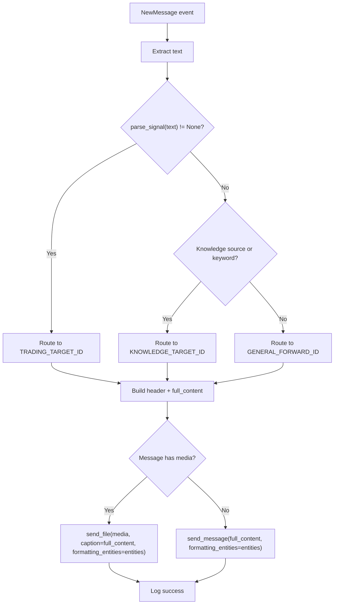
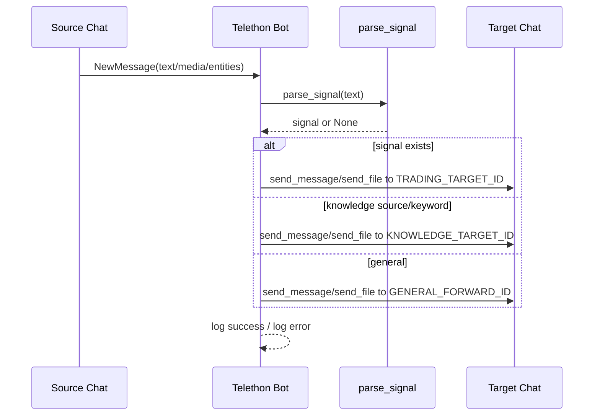

# Telegram Routing Blueprint

## 1. Overview
Tài liệu này mô tả thiết kế routing cho hàm `forward_all_messages` trong Telethon bot.
Mục tiêu là điều hướng tin nhắn theo ngữ nghĩa thay vì forward mù quáng.

## 2. Goals
- Route tin nhắn vào đúng đích: `TRADING_TARGET_ID`, `KNOWLEDGE_TARGET_ID`, `GENERAL_FORWARD_ID`.
- Không dùng `forward_to` để tránh bị chặn copy/forward.
- Bảo toàn định dạng gốc bằng `formatting_entities`.
- Hỗ trợ media + caption với header human-readable.

## 3. Configuration
Các biến môi trường liên quan:

- `KNOWLEDGE_TARGET_ID`: đích lưu kiến thức.
- `TRADING_TARGET_ID`: đích lưu tín hiệu trading.
- `GENERAL_FORWARD_ID`: đích lưu tất cả trường hợp còn lại.
- `KNOWLEDGE_SOURCE_IDS`: danh sách chat/channel ID nguồn kiến thức (JSON list hoặc comma-separated).
- `KNOWLEDGE_KEYWORDS`: danh sách từ khóa knowledge (comma-separated, lowercase khi parse).

## 4. Routing Logic
Thứ tự ưu tiên:

1. Trading flow: nếu `parse_signal(text)` trả về object hợp lệ.
2. Knowledge flow: nếu `event.chat_id` thuộc `KNOWLEDGE_SOURCE_IDS` hoặc text chứa `KNOWLEDGE_KEYWORDS`.
3. General flow: các trường hợp còn lại.

## 5. Flowchart (Mermaid)


## 6. Message Format
Header chuẩn:

```text
🚀 **TRADING SIGNAL**
• **Nguồn:** `Channel Name`
• **Lúc:** `12:00:00 13/05/2026`
---

(Original content)
```

Tag mapping:
- Trading: `🚀 **TRADING SIGNAL**`
- Knowledge: `📚 **KNOWLEDGE SOURCE**`
- General: `📥 **GENERAL ARCHIVE**`

## 7. Sequence (Mermaid)


## 8. Error Handling
- Toàn bộ flow nằm trong `try/except` để tránh crash loop.
- Nếu target ID tương ứng không tồn tại (`None`), bot bỏ qua tin nhắn.
- Parse lỗi cấu hình `KNOWLEDGE_SOURCE_IDS` sẽ fallback về danh sách rỗng.

## 9. Implementation Notes
- Không dùng `event.message.forward_to(...)`.
- Ép kiểu target ID: `int(str(target_id).strip())` trước khi gửi.
- Dùng `event.message.entities` làm `formatting_entities` để giữ Bold/Italic/Link.
- Nếu có media, gửi kèm caption chứa header + nội dung gốc.

## 10. Validation Checklist
- [ ] Signal hợp lệ đi vào `TRADING_TARGET_ID`.
- [ ] Message từ knowledge source đi vào `KNOWLEDGE_TARGET_ID`.
- [ ] Message thường đi vào `GENERAL_FORWARD_ID`.
- [ ] Không còn sử dụng `forward_to` trong mã nguồn.
- [ ] Bold/Italic/Link được giữ khi gửi lại.
- [ ] Media có caption đúng định dạng header.
